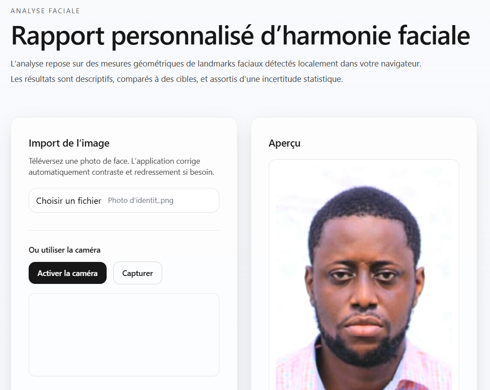
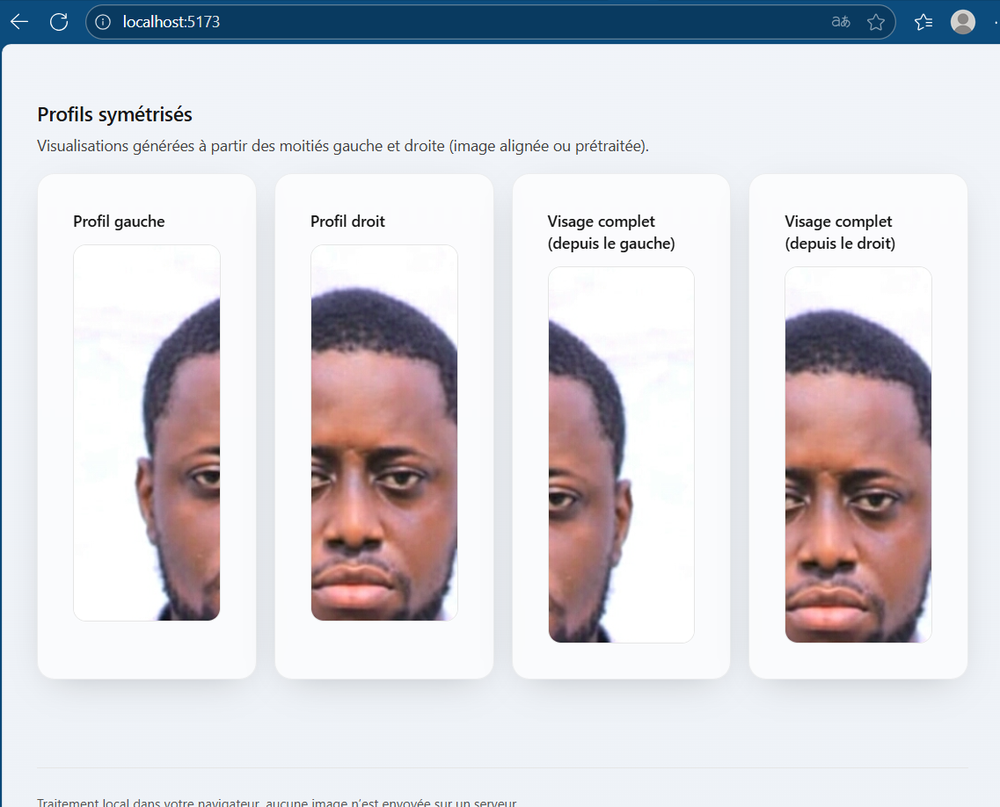
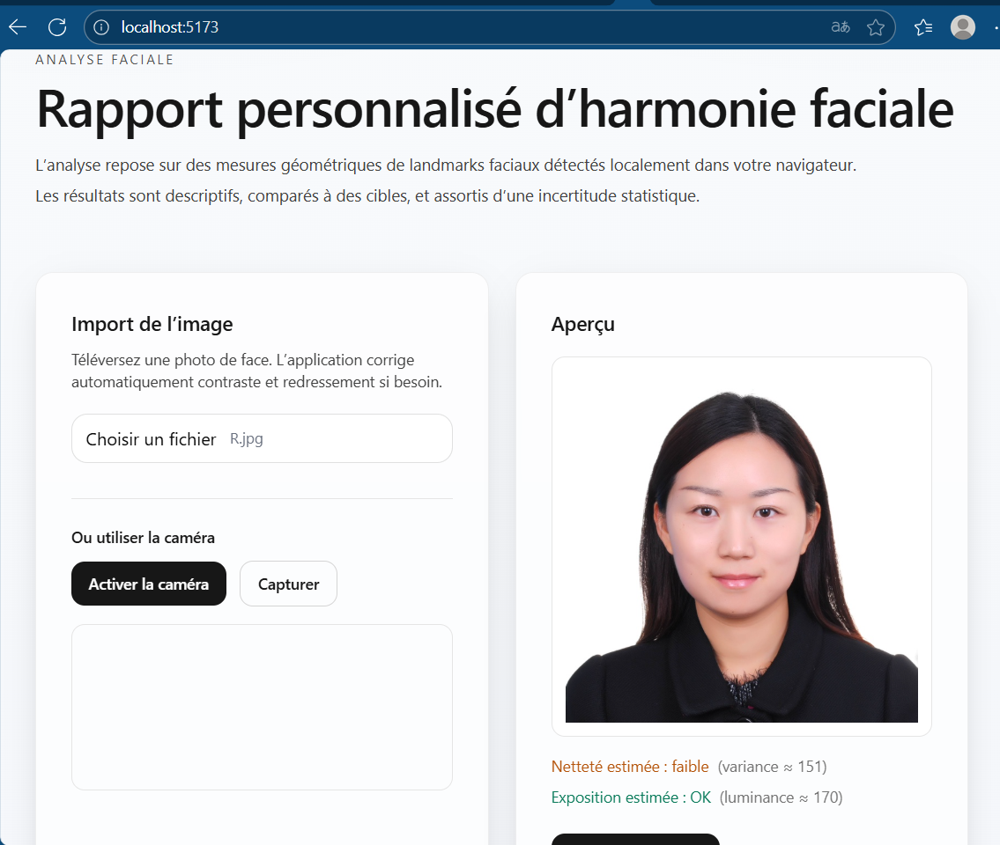
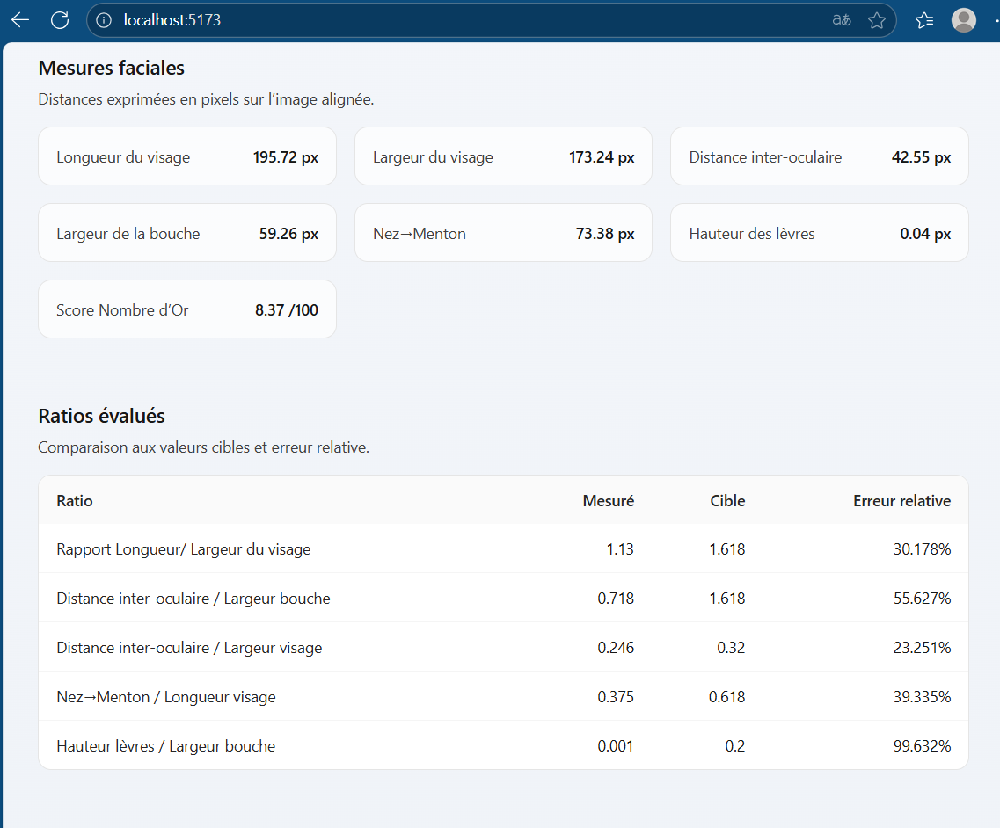

# Rapport d’harmonie faciale

## 1. Objet du projet

Cette application web évalue, à partir d’une photographie faciale de face, plusieurs **mesures morphométriques** (distances et ratios) ainsi que des **indices synthétiques** (symétrie, “nombre d’or”, harmonie, indice global, originalité). L’objectif n’est pas de “définir la beauté”, mais de **décrire quantitativement** certaines propriétés géométriques du visage, avec une **méthodologie explicite**, des **incertitudes** et des **limites** clairement formulées.

Tout le calcul s’effectue **localement dans le navigateur** (TensorFlow.js + MediaPipe FaceMesh). Aucune image n’est transmise à un serveur.



---

## 2. Principes scientifiques et méthodologie

### 2.1. Détection des points anatomiques (landmarks)
- Modèle : **MediaPipe FaceMesh (468 points)**, exécuté via **TensorFlow.js (backend WebGL)**.
- Sortie : coordonnées (x, y) **normalisées** dans \([0,1]\) pour chaque point du maillage.
- Choix de points de référence :
  - Front supérieur (10), menton (152), commissures labiales (61, 291), coins latéraux du visage (234, 454), yeux (133, 362), lèvres (13, 14), pointe du nez (1).
- Hypothèse : visage frontal, expression neutre, éclairage homogène. Les écarts à cette hypothèse augmentent l’incertitude.



### 2.2. Contrôles qualité a priori
- **Netteté (proxy)** : variance d’un gradient (approximation du Laplacien). Seuil empirique \(> 1500\).
- **Exposition** : luminance moyenne dans \([60,200]\) (8 bits).  
Ces contrôles préviennent des cas extrêmes (flou ou sous/surexposition).

### 2.3. Alignement et recadrage
- **Rotation** : l’image est **redressée** de sorte que la ligne inter-oculaire soit horizontale.
- **Recadrage** : centré sur le milieu inter-oculaire, taille proportionnelle à la distance inter-oculaire.
- Les **mesures** sont ensuite réalisées **sur l’image alignée**.

### 2.4. Mesures fondamentales (distances euclidiennes en pixels)
- **Longueur du visage** \(= \|T - B\|\)  
- **Largeur du visage** \(= \|L - R\|\)  
- **Distance inter-oculaire** \(= \|E_L - E_R\|\)  
- **Largeur de la bouche** \(= \|M_L - M_R\|\)  
- **Nez → menton** \(= \|N - C\|\)  
- **Hauteur des lèvres** \(= \|U - D\|\)  

### 2.5. Ratios et cibles
1. Longueur/largeur du visage ≈ **1.618**  
2. Distance inter-oculaire / Largeur bouche ≈ **1.618**  
3. Distance inter-oculaire / Largeur visage ≈ **0.32**  
4. Nez → menton / Longueur visage ≈ **0.618**  
5. Hauteur lèvres / Largeur bouche ≈ **0.20**

### 2.6. Score « Nombre d’or »

**Erreur relative :**


**Moyenne des erreurs :**


**Conversion score :**


### 2.7. Score de symétrie


### 2.8. Score d’harmonie et indices globaux

**Harmonie :**


**Indice global (1–10) :**


**Originalité (1–10) :**

dépend des écarts aux pivots 50/60/70

### 2.9. Incertitude et IC 95 %

- Bootstrap (bruit gaussien )
- Recalcul (N=40) → moyenne ± IC95
- Permet d’évaluer la robustesse des résultats

---

## 3. Limitations
- **Variabilité culturelle** : les ratios sont culturels, pas universels.  
- **Conditions de prise de vue** : expression, maquillage, lumière, accessoires influencent.  
- **Erreur de landmarks** : le modèle n’est pas médical.  
- **Un seul visage traité**.



---

## 4. Reproductibilité
- Pipeline déterministe.  
- Dépendances figées (`package.json`).  
- Versionnage méthodologique.  
- Affichage des **mesures brutes + ratios + erreurs relatives**.


---

## 5. Architecture technique

### 5.1. Technologies employées
- **React + Vite + TailwindCSS** : pour l’interface utilisateur moderne, réactive et adaptable.  
- **shadcn/ui** : composants UI accessibles, sobres et professionnels.  
- **TensorFlow.js (backend WebGL)** : pour l’inférence et l’accélération GPU dans le navigateur.  
- **MediaPipe FaceMesh** : détection faciale (468 points anatomiques).  
- **Typescript** : typage statique pour robustesse et maintenabilité. 

Arborescence :

### 5.2. Arborescence du projet

```
harmonie-faciale/
├── node_modules/
├── public/
│   └── favicon.ico
├── src/
│   ├── App.tsx
│   ├── main.tsx
│   ├── index.css
│   ├── components/
│   │   ├── Card.tsx
│   │   ├── Button.tsx
│   │   ├── Progress.tsx
│   │   ├── Metric.tsx
│   │   └── CanvasFrame.tsx
│   ├── utils/
│   │   ├── calculations.ts
│   │   └── feedback.ts
│   └── types/
│       └── landmarks.ts
├── docs/
│   ├── methodology.md
│   ├── results.md
│   └── figures/
│       ├── pipeline.png
│       └── example_output.png
├── .gitignore
├── index.html
├── package.json
├── package-lock.json
├── postcss.config.js
├── tailwind.config.js
├── tsconfig.json
├── vite.config.ts
├── README.md
└── LICENSE
```

### 5.3. Flux de traitement
1. **Import** (image ou webcam).  
2. **Détection landmarks** via MediaPipe.  
3. **Calcul mesures** (distances, ratios, scores).  
4. **Évaluation** (symétrie, nombre d’or, harmonie).  
5. **Restitution** : tableaux de mesures, graphiques, feedback textuel, visualisations symétrisées.

---

## 6. Installation et exécution

### 6.1. Prérequis
- Node.js ≥ 18  
- npm ≥ 9  
- Navigateur compatible WebGL

### 6.2. Installation
```bash
# 0) Clonnage depot
git clone https://github.com/DavidLUTALA/Beauty_Score.git
cd Beauty_Score

# 1) Installation des dépendances
npm install

# 2) Lancement en développement
npm run dev
# Ouvrir l’URL locale affichée (ex. http://localhost:5173)

# 3) Build de production
npm run build
npm run preview
```


### 6.3. 📦 Dépendances clés

- @tensorflow/tfjs
- @tensorflow/tfjs-backend-webgl
- @tensorflow-models/face-landmarks-detection
- react, vite, tailwindcss(styles)

---

## 7. Utilisation

1. Charger une photo de face (ou capturer via la caméra).
2. Lancer l’analyse.
3. Lire les résultats :

   - **Résultats quantitatifs (scores)** avec ± IC 95 %  
   - **Mesures faciales (pixels)**  
   - **Ratios évalués** (valeur, cible, erreur relative)  
   - **Analyse et conclusions** (texte), drapeaux Netteté/Exposition  
   - **Profils symétrisés** (gauche/droite)  

👉 Astuce : privilégier une image bien éclairée, sans inclinaison, visage centré.


---

## 8. Validation et tests

- **Tests de sensibilité** : variation contrôlée de l’angle, du recadrage, de la luminosité → suivi des variations de scores.  
- **Tests de stabilité** : multi-frames caméra → réduction de variance via médiane.  
- **Contrôles limites** : images floues, sous/surexposées, masques/occlusions → drapeaux qualité et/ou refus d’analyse.  

> Note : ce projet n’emploie pas de base d’images personnelles.  
> Pour des évaluations quantitatives poussées (erreurs absolues sur landmarks), utiliser des jeux publics annotés et des métriques standard (NME, AUC, CED).

---

## 9. Considérations éthiques et de confidentialité

- **Confidentialité** : aucun envoi de l’image hors du navigateur.  
- **Transparence** : formules, poids et seuils sont documentés et versionnés.  
- **Non-discrimination** : pas d’“étalon de beauté”. Les mesures sont descriptives, contextualisées, et accompagnées d’incertitudes.  
- **Consentement** : ne pas analyser des photos de tiers sans autorisation.

---

## 10. Performances et recommandations

- Taille d’entrée caméra plafonnée (ex. 640×480) pour temps d’inférence stables.  
- Warm-up du modèle au chargement.  
- Possibilité future : **Web Worker + OffscreenCanvas** pour déporter des calculs lourds et améliorer la réactivité UI.

---

## 11. Dépannage

- **“No face detected”** : vérifier pose frontale, lumière, absence d’occlusions.  
- **Scores instables** : préférer une photo fixe, nette ; éviter le flou de mouvement.  
- **WebGL désactivé** : activer l’accélération matérielle du navigateur.  
- **Build/Dev** : s’assurer que `node_modules` est installé, supprimer le cache Vite si besoin (`rm -rf node_modules/.vite`).  

---

## 12. Licence, attribution et citation

- **Code** : voir le fichier de licence associé au dépôt (à compléter).  
- **Citation** : si vous utilisez ce projet dans un article, merci de citer le dépôt et d’indiquer la version de la méthodologie.  

Exemple de citation informelle :  
> “Rapport d’harmonie faciale (v1.2.0). Application Web, TensorFlow.js + MediaPipe FaceMesh, analyse morphométrique et IC 95 % par bootstrap.”

---

## 13. Avertissement

Cette application **ne constitue ni un avis médical, ni un instrument de diagnostic**.  
Elle ne “mesure pas la beauté” ; elle décrit des propriétés géométriques d’une image, sous hypothèses et avec incertitudes.  

Toute interprétation doit rester **prudente et contextualisée**.
